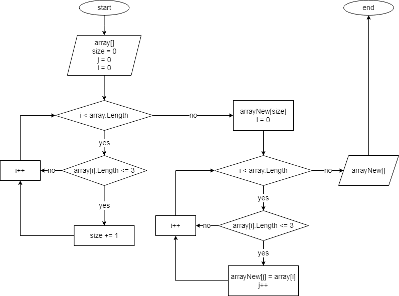

# Это readme-файл для контрольной работы Агеевой Анастасии по итогу прохождения первого блока обучения по программе Разработчик на GeekBrains. 
  

*Моими задачами на этой контрольной работе были:*
1. Создать репозиторий на GitHub.
2. Нарисовать блок-схему алгоритма. Я нарисовала блок-схему основной содержательной части, выделив отдельный метод для решения этой задачи.
3. Снабдить репозиторий оформленным текстовым описанием решения (README).
4. Написать программу, решающую поставленную задачу. 
5. Использовать контроль версий Git в работе над этим проектом (сделать коммиты по крайней мере на пункты 2, 3, 4).

**Задача:**  
Написать программу, которая из имеющегося массива строк формирует массив строк, длина который меньше или равна трем символам. Первоначальный массив задать либо ввести с клавиатуры. Не пользоваться коллекциями, обойтись массивами.

_**Примеры:**_
* ["hello", "2", "world", ":-)"] -> ["2", ":-)"]
* ["1234", "1567", "-2", "computer science"] -> ["-2"]
* ["Russia", "Denmark", "Kazan"] -> []

    

## Блок-схема метода представлена на следующем рисунке:
